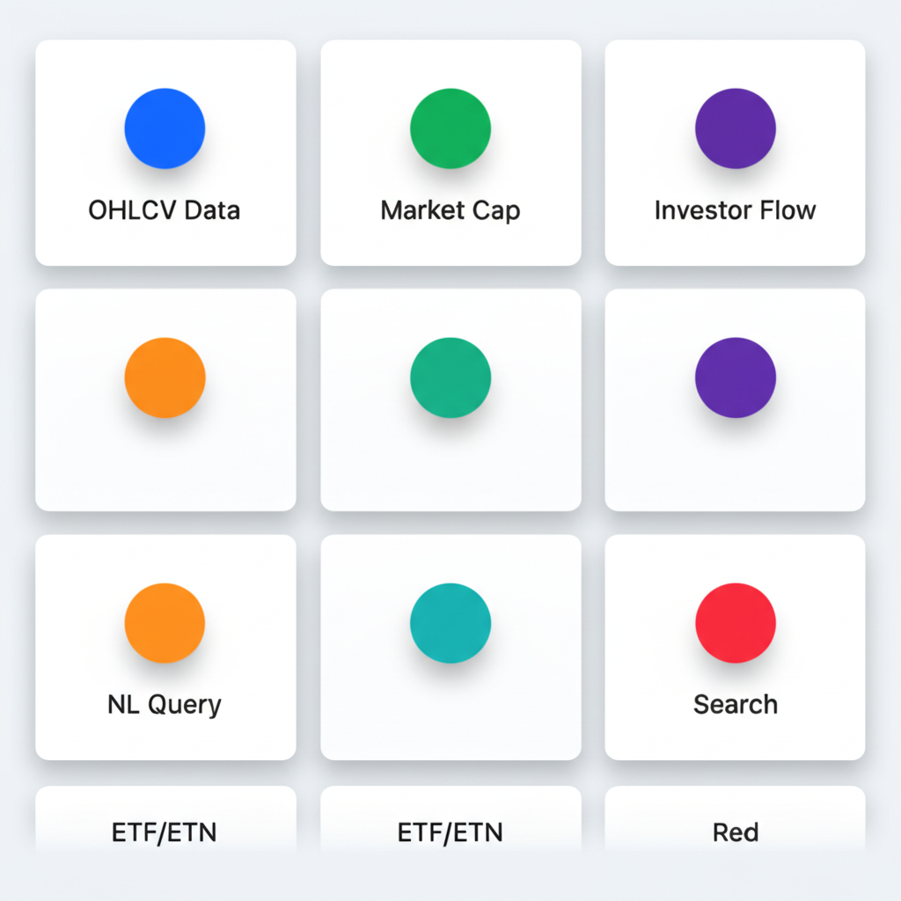
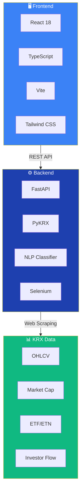
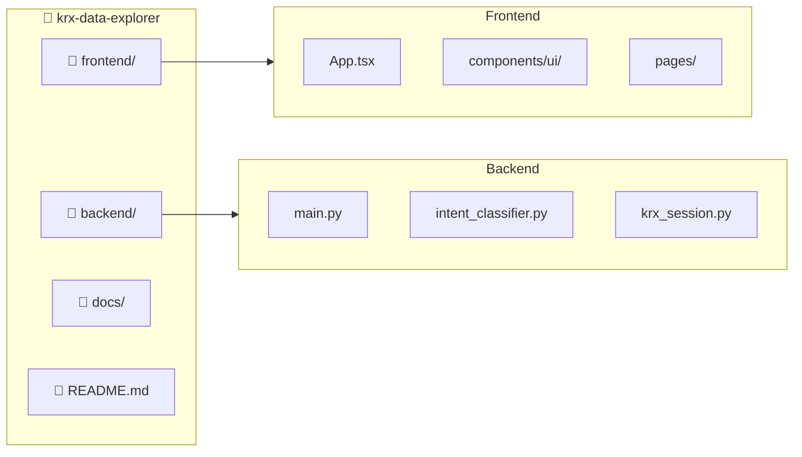

# KRX Data Explorer

<div align="center">


**한국거래소(KRX) 주식 데이터를 자연어로 조회하고 시각화하는 오픈소스 플랫폼**

[](https://python.org)
[](https://fastapi.tiangolo.com)
[](https://reactjs.org)
[](https://typescriptlang.org)

[시작하기](#-빠른-시작) | [API 문서](#-api-엔드포인트) | [기능 소개](#-주요-기능)

</div>

---

## 한눈에 보기

> **"삼성전자 PER 알려줘"** 라고 입력하면, 자동으로 KRX에서 데이터를 가져와 보여줍니다.

### 데이터 흐름


---

## 주요 기능



| 기능 | 설명 |
|------|------|
| **OHLCV 데이터** | 시가, 고가, 저가, 종가, 거래량 조회 |
| **시가총액** | 종목별 시가총액 및 상장주식수 |
| **투자자 동향** | 기관, 외국인, 개인 순매수 현황 |
| **자연어 질의** | 한국어로 질문하면 자동으로 API 호출 |
| **ETF/ETN/ELW** | 파생상품 데이터 조회 |
| **시각화** | GraphicWalker 기반 무코드 데이터 시각화 |

---

## 시스템 아키텍처

### 구조도 (Mermaid)




---

## UI 미리보기


---

## 빠른 시작

### 사전 요구사항

- **Python** 3.10+
- **Node.js** 18+
- **Chrome** (KRX 로그인용)

### 1. 백엔드 설정

```bash
cd backend

# 가상환경 생성
python -m venv venv
.\venv\Scripts\activate  # Windows
# source venv/bin/activate  # macOS/Linux

# 의존성 설치
pip install -r requirements.txt

# 환경변수 설정
echo KRX_USER_ID=your_id > .env
echo KRX_PASSWORD=your_password >> .env

# 서버 실행
uvicorn main:app --reload --port 8000
```

### 2. 프론트엔드 설정

```bash
cd frontend

npm install
npm run dev
```

### 3. 접속

| 서비스 | URL |
|--------|-----|
| 프론트엔드 | http://localhost:5173 |
| 백엔드 API | http://localhost:8000 |
| Swagger 문서 | http://localhost:8000/docs |

---

## API 엔드포인트

### 기본 데이터

```bash
GET /api/ohlcv/{date}           # 특정 일자 OHLCV
GET /api/ohlcv/range/{ticker}   # 기간별 OHLCV
GET /api/market-cap/{date}      # 시가총액
GET /api/fundamental/{date}     # PER/PBR/배당수익률
```

### 투자자 동향

```bash
GET /api/investor/{date}        # 투자자별 매매동향
GET /api/net-purchases/{start}/{end}  # 순매수 상위 종목
GET /api/foreign-holding/{date} # 외국인 보유현황
```

### 파생상품

```bash
GET /api/etf/list               # ETF 목록
GET /api/etn/list               # ETN 목록
GET /api/elw/list               # ELW 목록
```

### 자연어 질의

```bash
POST /api/nl/query              # 자연어 질의 처리
POST /api/intent/classify       # 의도 분류
```

---

## 프로젝트 구조



```
krx-data-explorer/
├── frontend/                 # React + TypeScript + Vite
│   ├── src/
│   │   ├── App.tsx           # 메인 애플리케이션
│   │   ├── components/ui/    # shadcn/ui 컴포넌트
│   │   └── pages/            # 페이지 컴포넌트
│   └── package.json
│
├── backend/                  # FastAPI + Python
│   ├── main.py               # FastAPI 앱 (40+ 엔드포인트)
│   ├── intent_classifier.py  # 자연어 의도 분류기
│   ├── krx_session.py        # KRX 세션 관리
│   └── requirements.txt
│
├── docs/                     # 다이어그램
└── README.md
```

---

## 기술 스택

| 구분 | 기술 |
|------|------|
| **Frontend** | React 18, TypeScript, Vite, Tailwind CSS, shadcn/ui, GraphicWalker |
| **Backend** | FastAPI, Python 3.10+, PyKRX, Selenium, Pandas |
| **Data Source** | KRX Data Marketplace |

---

## 주의사항

### PyKRX Windows 인코딩 이슈

PyKRX는 Windows에서 한글 인코딩 문제가 있습니다. 이 프로젝트에서는:

1. **쿠키 주입**: pykrx import 전에 KRX 세션 쿠키 주입
2. **직접 API 호출**: 인코딩 문제가 심한 경우 KRX API 직접 호출
3. **영문 컬럼명**: 한글 컬럼명 대신 영문 사용

### KRX 로그인

- KRX Data Marketplace 계정이 필요합니다
- 일부 데이터는 로그인 없이도 조회 가능
- 세션은 자동으로 유지되며 쿠키가 저장됩니다

---

## 라이선스

MIT License

---

## 감사의 말

- [PyKRX](https://github.com/sharebook-kr/pykrx) - KRX 데이터 수집 라이브러리
- [Graphic Walker](https://github.com/Kanaries/graphic-walker) - 데이터 시각화
- [shadcn/ui](https://ui.shadcn.com/) - UI 컴포넌트

---

<div align="center">

Made with ❤️ for Korean Stock Market Data

**[MinDongJae](https://github.com/MinDongJae)**

</div>
