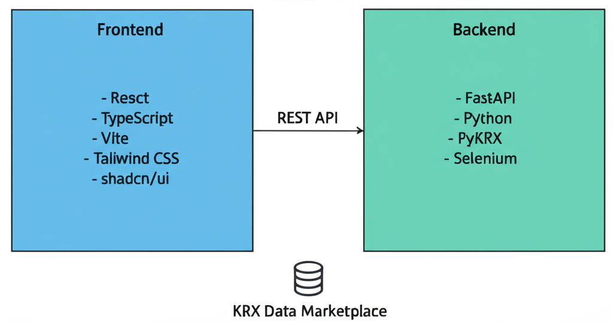
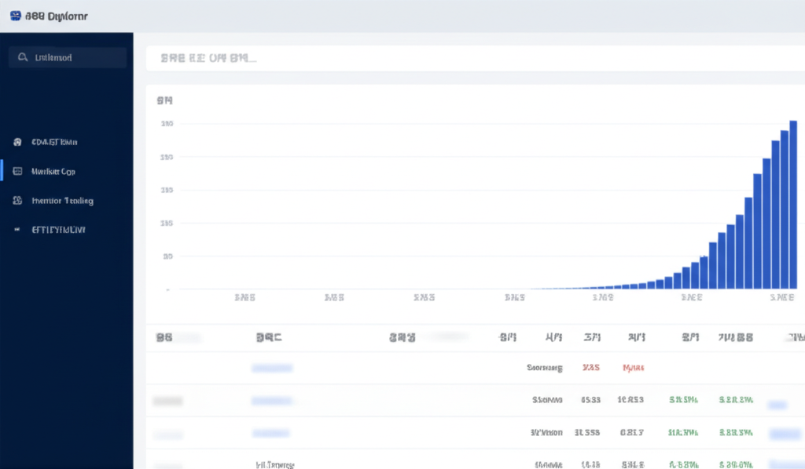
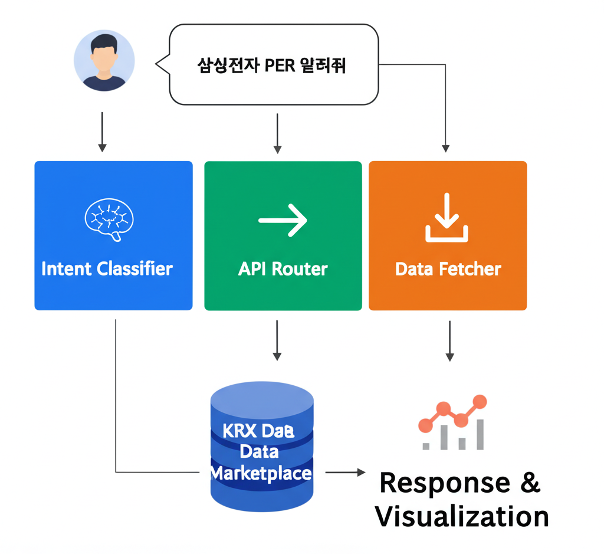

# KRX Data Explorer

한국거래소(KRX) 주식 데이터를 조회하고 시각화하는 웹 애플리케이션입니다.



## 📋 주요 기능

### 🔍 데이터 조회
- **OHLCV 데이터**: 시가, 고가, 저가, 종가, 거래량
- **시가총액**: 종목별 시가총액 및 상장주식수
- **기본 지표**: PER, PBR, EPS, DIV, BPS
- **투자자별 매매동향**: 기관, 외국인, 개인 순매수
- **외국인 보유현황**: 보유량, 보유비율, 한도소진율
- **ETF/ETN/ELW**: 각종 파생상품 데이터

### 📊 시각화
- **GraphicWalker**: 드래그 앤 드롭 방식의 무코드 데이터 시각화
- **인터랙티브 차트**: 다양한 차트 유형 지원



### 💬 자연어 질의
- 한국어로 질문하면 적절한 API를 자동 호출
- 예: "삼성전자 PER 알려줘", "오늘 외국인 순매수 종목"



## 🏗️ 시스템 아키텍처

```
┌─────────────────────────────────────────────────────────────────┐
│                        Frontend                                  │
│  ┌─────────┐ ┌─────────┐ ┌─────────┐ ┌─────────────────────┐   │
│  │  React  │ │  Vite   │ │Tailwind │ │  GraphicWalker      │   │
│  │   +TS   │ │         │ │   CSS   │ │  (시각화)           │   │
│  └─────────┘ └─────────┘ └─────────┘ └─────────────────────┘   │
└────────────────────────────┬────────────────────────────────────┘
                             │ REST API
┌────────────────────────────▼────────────────────────────────────┐
│                        Backend                                   │
│  ┌─────────┐ ┌─────────────────┐ ┌─────────────────────────┐   │
│  │ FastAPI │ │ Intent          │ │ KRX Session Manager     │   │
│  │         │ │ Classifier      │ │ (Selenium + Cookies)    │   │
│  └─────────┘ └─────────────────┘ └─────────────────────────┘   │
│  ┌─────────────────────────────────────────────────────────┐   │
│  │                    PyKRX (Patched)                       │   │
│  └─────────────────────────────────────────────────────────┘   │
└────────────────────────────┬────────────────────────────────────┘
                             │
┌────────────────────────────▼────────────────────────────────────┐
│                   KRX Data Marketplace                          │
│  ┌─────────┐ ┌─────────┐ ┌─────────┐ ┌─────────┐              │
│  │  OHLCV  │ │ Market  │ │Investor │ │ETF/ETN  │              │
│  │  Data   │ │   Cap   │ │ Trading │ │  /ELW   │              │
│  └─────────┘ └─────────┘ └─────────┘ └─────────┘              │
└─────────────────────────────────────────────────────────────────┘
```

## 📁 프로젝트 구조

```
krx-data-explorer/
├── frontend/                 # React + TypeScript + Vite
│   ├── src/
│   │   ├── App.tsx           # 메인 애플리케이션
│   │   ├── components/ui/    # shadcn/ui 컴포넌트
│   │   ├── pages/            # 페이지 컴포넌트
│   │   └── lib/              # 유틸리티
│   ├── package.json
│   └── vite.config.ts
│
├── backend/                  # FastAPI + Python
│   ├── main.py               # FastAPI 앱 (2,338줄, 40+ 엔드포인트)
│   ├── intent_classifier.py  # 자연어 의도 분류기 (748줄)
│   ├── krx_session.py        # KRX 세션 관리 (677줄)
│   ├── pykrx_with_login.py   # PyKRX 패치 모듈 (148줄)
│   └── requirements.txt
│
├── docs/                     # 문서 및 다이어그램
│   ├── architecture-diagram.png
│   ├── data-flow-diagram.png
│   └── ui-mockup.png
│
└── README.md
```

## 🚀 시작하기

### 사전 요구사항

- **Node.js** 18+ (프론트엔드)
- **Python** 3.10+ (백엔드)
- **Chrome** 또는 **Chromium** (KRX 로그인용)

### 백엔드 설정

```bash
cd backend

# 가상환경 생성 및 활성화
python -m venv venv
.\venv\Scripts\activate  # Windows
# source venv/bin/activate  # macOS/Linux

# 의존성 설치
pip install -r requirements.txt

# 환경변수 설정 (.env 파일 생성)
echo KRX_USER_ID=your_id > .env
echo KRX_PASSWORD=your_password >> .env

# 서버 실행
uvicorn main:app --reload --port 8000
```

### 프론트엔드 설정

```bash
cd frontend

# 의존성 설치
npm install

# 개발 서버 실행
npm run dev
```

### 접속

- 프론트엔드: http://localhost:5173
- 백엔드 API: http://localhost:8000
- API 문서 (Swagger): http://localhost:8000/docs

## 📡 API 엔드포인트

### 기본 데이터

| 엔드포인트 | 설명 |
|-----------|------|
| `GET /api/ohlcv/{date}` | 특정 일자 OHLCV |
| `GET /api/ohlcv/range/{ticker}` | 기간별 OHLCV |
| `GET /api/market-cap/{date}` | 시가총액 |
| `GET /api/fundamental/{date}` | PER/PBR/배당수익률 |

### 투자자 동향

| 엔드포인트 | 설명 |
|-----------|------|
| `GET /api/investor/{date}` | 투자자별 매매동향 |
| `GET /api/net-purchases/{start}/{end}` | 순매수 상위 종목 |
| `GET /api/foreign-holding/{date}` | 외국인 보유현황 |

### 파생상품

| 엔드포인트 | 설명 |
|-----------|------|
| `GET /api/etf/list` | ETF 목록 |
| `GET /api/etn/list` | ETN 목록 |
| `GET /api/elw/list` | ELW 목록 |

### 자연어

| 엔드포인트 | 설명 |
|-----------|------|
| `POST /api/nl/query` | 자연어 질의 처리 |
| `POST /api/intent/classify` | 의도 분류 |

## 🔧 환경 변수

### 백엔드 (.env)

```env
# KRX Data Marketplace 로그인 정보
KRX_USER_ID=your_id
KRX_PASSWORD=your_password

# 선택적
OPENAI_API_KEY=sk-...  # LLM 의도 분류용
```

## ⚠️ 주의사항

### PyKRX Windows 인코딩 이슈

PyKRX는 Windows에서 한글 인코딩 문제가 있습니다. 이 프로젝트에서는 다음 방식으로 해결합니다:

1. **쿠키 주입**: pykrx import 전에 KRX 세션 쿠키 주입
2. **직접 API 호출**: 인코딩 문제가 심한 경우 KRX API 직접 호출
3. **영문 컬럼명**: 한글 컬럼명 대신 영문 사용

### KRX 로그인

- KRX Data Marketplace 계정이 필요합니다
- 일부 데이터는 로그인 없이도 조회 가능합니다
- 세션은 자동으로 유지되며 쿠키가 저장됩니다

## 🛠️ 기술 스택

| 구분 | 기술 |
|------|------|
| **Frontend** | React 18, TypeScript, Vite, Tailwind CSS, shadcn/ui, GraphicWalker |
| **Backend** | FastAPI, Python 3.10+, PyKRX, Selenium, Pandas |
| **Database** | KRX Data Marketplace (외부 API) |

## 📄 라이선스

MIT License

## 🙏 감사의 말

- [PyKRX](https://github.com/sharebook-kr/pykrx) - KRX 데이터 수집 라이브러리
- [Graphic Walker](https://github.com/Kanaries/graphic-walker) - 데이터 시각화
- [shadcn/ui](https://ui.shadcn.com/) - UI 컴포넌트
